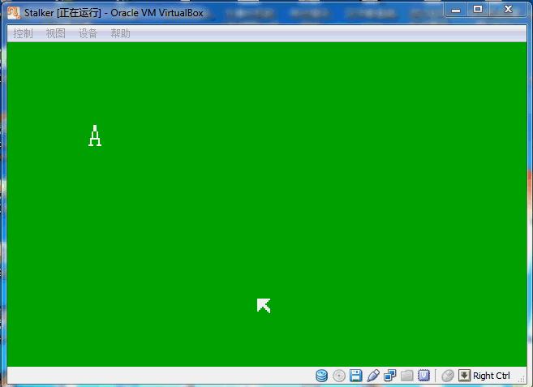

Stalker
=======

My Own Operating System----Stalker OS

This is my own operating system project, called "Stalker OS".

I was a student from Hohai University in Nanjing, China.

Now, I am working as a software enigneer in Shanghai.

===============================================================================================

===============================================================================================
      You can run Stalker like this:

            step 0:
            Download  all files, or just "boot.img", because "boot.img" is final OS image.
            
            step 1:
            Run VirtualBox or other virtual machine.
            
            step 2:
            Just load "boot.img" by floppy, and run Stalker OS! 
  
================================================================================================

Thanks:
=======
      <<Orang's 一个操作系统的实现>> 于渊 著
      <<30天自制操作系统>> 川合秀实 著
      <<x86汇编语言-从实模式到保护模式>> 李忠 等 著
      intel comporation
      ...
================================================================================================

	
	by  Henry Wang(王鸿缘)

